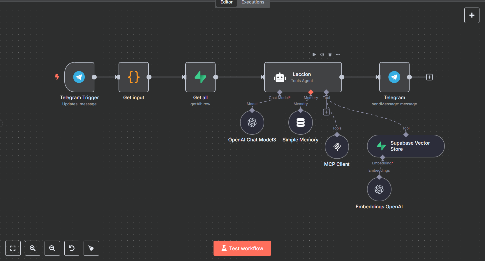

# TutorBot - English Learning Workflow

## Overview
TutorBot is an English Tutoring Agent built with **n8n**, designed to guide students from **A1** to **B2** levels of the CEFR. It offers structured lessons, quizzes, and level exams, tracks real-time progress, and communicates in Spanish through **Telegram**.

## Features

- **Initial Assessment**: Assigns **A1** level to new users and generates diagnostic quizzes.
- **Lesson Delivery**: Provides 3 to 4 weekly sessions (30–45 minutes each), including review, new topics, and micro-quizzes.
- **Progress Tracking**: Updates user progress in **Supabase** after each lesson or quiz.
- **Activity Scheduling**: Reserves sessions and sends reminders via the **MCP Calendar API**.
- **Feedback and Motivation**: Offers positive reinforcement and additional exercises for scores below 80%.

### Data Sources
- **Supabase SQL**: Manages `cefr_levels`, `lessons`, and `user_progress` tables.
- **Vector Database**: Retrieves content from textbooks.
- **Calendar Service**: Schedules lessons and quizzes.

## Workflow Structure

### Main Nodes
1. **Telegram Trigger**: Captures user messages.
2. **Get Input**: Processes user text and data.
3. **Get All**: Retrieves user progress from **Supabase**.
4. **Lesson (Agent)**: Core logic for delivering lessons and tracking progress.
5. **OpenAI Chat Model**: Generates lesson content using GPT models.
6. **Supabase Vector Store**: Retrieves textbook content.
7. **Embeddings OpenAI**: Generates embeddings for vector search.
8. **MCP Client**: Handles calendar operations.
9. **Simple Memory**: Maintains chat context.
10. **Telegram**: Sends responses to users.

### Connections
Links nodes for seamless data flow from **Telegram** input to the generated response.

## Configuration

### Credentials
- **Telegram API**: Configure in `Telegram Trigger` and `Telegram` nodes.
- **Supabase API**: Set up in `Supabase Vector Store` and `Get All` nodes.
- **OpenAI API**: Add to `OpenAI Chat Model` and `Embeddings OpenAI` nodes.

### Environment
- Ensure **Supabase** tables (`cefr_levels`, `lessons`, `user_progress`) are set up.
- Verify the **MCP Calendar API** endpoint.

### Activation
1. Enable the workflow in **n8n** (`active: true`).
2. Test the **Telegram** webhook integration.

## Policies

- **Frequency**: 3–4 lessons per week, daily micro-quizzes, weekly quizzes, and level exams.
- **Sequence**: Follows textbook order without skipping.
- **Evaluation**: Requires ≥80% to pass quizzes; ≥70% for remediation.
- **Responses**: Always in Spanish.

## Usage

1. Users interact via **Telegram**, sending messages to trigger lessons or quizzes.
2. TutorBot responds with personalized content, schedules sessions, and tracks user progress.

## Dependencies

- **n8n**
- **Telegram API**
- **Supabase** (SQL + Vector Database)
- **OpenAI API**
- **MCP Calendar API**

---

# TutorBot - Flujo de Aprendizaje de Inglés

## Resumen
TutorBot es un Agente Tutor de Inglés construido con **n8n**, diseñado para guiar a los estudiantes desde el nivel **A1** hasta **B2** del MCER. Ofrece lecciones estructuradas, cuestionarios y exámenes de nivel, rastrea el progreso en tiempo real y se comunica en español a través de **Telegram**.

## Características

- **Evaluación Inicial**: Asigna el nivel **A1** a nuevos usuarios y genera cuestionarios diagnósticos.
- **Entrega de Lecciones**: Proporciona de 3 a 4 sesiones semanales (30–45 minutos), incluyendo repaso, nuevos temas y micro-cuestionarios.
- **Seguimiento de Progreso**: Actualiza el progreso del usuario en **Supabase** tras cada lección o cuestionario.
- **Programación de Actividades**: Reserva sesiones y envía recordatorios mediante la **API de calendario MCP**.
- **Retroalimentación y Motivación**: Ofrece refuerzo positivo y ejercicios adicionales para puntajes menores al 80%.

### Fuentes de Datos
- **Supabase SQL**: Gestiona tablas de `cefr_levels`, `lessons` y `user_progress`.
- **Base de Datos Vectorial**: Recupera contenido de libros de texto.
- **Servicio de Calendario**: Programa lecciones y cuestionarios.

## Estructura del Flujo

### Nodos Principales
1. **Telegram Trigger**: Captura mensajes de los usuarios.
2. **Get Input**: Procesa texto y datos del usuario.
3. **Get All**: Obtiene el progreso del usuario desde **Supabase**.
4. **Lección (Agent)**: Lógica principal para entrega de lecciones y seguimiento de progreso.
5. **OpenAI Chat Model**: Genera contenido de lecciones utilizando modelos GPT.
6. **Supabase Vector Store**: Recupera contenido de libros de texto.
7. **Embeddings OpenAI**: Genera incrustaciones para búsqueda vectorial.
8. **MCP Client**: Maneja operaciones de calendario.
9. **Simple Memory**: Mantiene el contexto del chat.
10. **Telegram**: Envía respuestas a los usuarios.

### Conexiones
Vincula los nodos para un flujo de datos continuo desde la entrada de **Telegram** hasta la respuesta generada.

## Configuración

### Credenciales
- **API de Telegram**: Configurar en los nodos `Telegram Trigger` y `Telegram`.
- **API de Supabase**: Establecer en `Supabase Vector Store` y `Get All`.
- **API de OpenAI**: Agregar en los nodos `OpenAI Chat Model` y `Embeddings OpenAI`.

### Entorno
- Asegurar que las tablas de **Supabase** (`cefr_levels`, `lessons`, `user_progress`) estén configuradas.
- Verificar el endpoint de la **API de calendario MCP**.

### Activación
1. Habilitar el flujo en **n8n** (`active: true`).
2. Probar la integración del webhook de **Telegram**.

## Políticas

- **Frecuencia**: 3–4 lecciones por semana, micro-cuestionarios diarios, cuestionarios semanales y exámenes de nivel.
- **Secuencia**: Sigue el orden del libro de texto sin saltos.
- **Evaluación**: Se requiere un puntaje ≥80% para aprobar cuestionarios; ≥70% para remediación.
- **Respuestas**: Siempre en español.

## Uso

1. Los usuarios interactúan vía **Telegram**, enviando mensajes para activar lecciones o cuestionarios.
2. TutorBot responde con contenido personalizado, programa sesiones y rastrea el progreso del usuario.

## Dependencias

- **n8n**
- **API de Telegram**
- **Supabase** (SQL + Base de Datos Vectorial)
- **API de OpenAI**
- **API de Calendario MCP**

